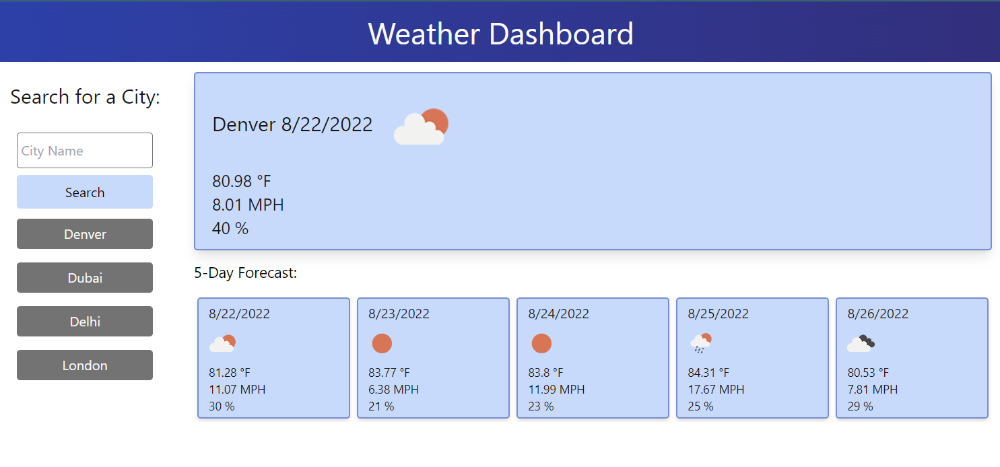

# Weather Dashboard
 UofU-VIRT-FSF-PT-07-2022-U-LOLC-MWTH Module 06 Challenge Server-Side APIs: Weather Dashboard

## Completed Mockup

This is a weather dashboard for quickly checking the weather in any city. Search for a city, and the current weather and a 5-day forecast. The dashboard will keep track of up to 10 pervious searches to help users compare weather in different locations. 

Live URL: https://icunningham7.github.io/Weather-Dashboard/

Mockup Preview Image: 


## Project Requirements

### User Story

```
AS A traveler
I WANT to see the weather outlook for multiple cities
SO THAT I can plan a trip accordingly
```

### Acceptance Criteria

```
GIVEN a weather dashboard with form inputs
WHEN I search for a city
THEN I am presented with current and future conditions for that city and that city is added to the search history
WHEN I view current weather conditions for that city
THEN I am presented with the city name, the date, an icon representation of weather conditions, the temperature, the humidity, the wind speed, and the UV index
WHEN I view the UV index
THEN I am presented with a color that indicates whether the conditions are favorable, moderate, or severe
WHEN I view future weather conditions for that city
THEN I am presented with a 5-day forecast that displays the date, an icon representation of weather conditions, the temperature, the wind speed, and the humidity
WHEN I click on a city in the search history
THEN I am again presented with current and future conditions for that city
```
